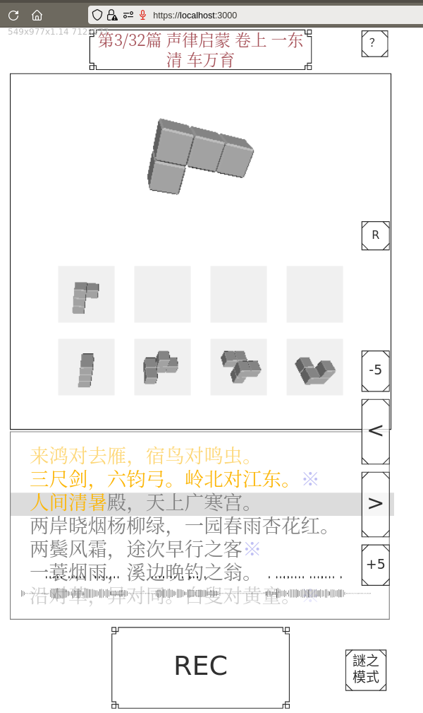

模仿 [Haskely的WebASR](https://github.com/Haskely/WebASR) 的一个练习用小玩意。

* 训练过程参考了[此文](https://blog.csdn.net/m0_37700507/article/details/85013091)
  * 参考：[DFCNN](www.infocomm-journal.com/dxkx/EN/article/downloadArticleFile.do?attachType=PDF&id=166970)
* 所用程序库版本：
  * python 3.9
  * tensorflow 2.6.0, tensorflow-gpu 2.6.0
  * tensorflowjs 3.9.0
  * p5.js （用于绘图）
  * 测试用的是Firefox
* 所用数据集：
  * [thchs-30](http://openslr.org/18/)
* 训练速度大致参考：
  * GTX 1060: 1000句，每个batch 10句，一个epoch的时间=122秒（每秒8.19句）
  * RTX 3060 Ti: 13300句话，每个batch 5句话，一个epoch的时间=450秒（每秒29.5句）
  * GTX 1650: 13300句话，每个batch 5句话，一个epoch的时间=1080秒（每秒12.31句）

* 运行方式
  * `node app.js`
  * 然后在浏览器中打开`localhost:3000`
* 训练方式
  * 首先安装依赖项
  * 然后`LD_LIBRARY_PATH=/usr/local/cuda-11.2/lib64 python3 thchs_py3.py train`；一次是一个 epoch
* 布署方式
  * `tensorflowjs_converter --input_format keras weights_my_py3/model.h5 /tmp/h5/`
  * 然后将其中内容复制到model路径下

还要修复许多bug和优化很多地方 :-S
